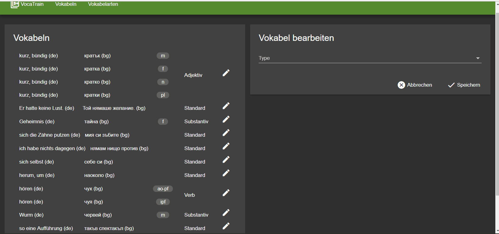

# VocaTrain

This project was generated with [Angular CLI](https://github.com/angular/angular-cli) version 1.7.4.

# Installation
* Point `$COUCHDB_LUCENE` to some path locating where couchdb-lucene will be installed
* Let `$COUCHDB_HOME` be the path to your Apache CouchDB installation directory
* Let `$VOCATRAIN_HOME` be the path to your vocatrain git clone
* Ensure that CouchDB 2.x is up and running at http://localhost:5984/
* Install Apache Maven 3.x and make it available through $PATH
* `git clone git@github.com:rnewson/couchdb-lucene.git` to $COUCHDB_LUCENE (https://github.com/rnewson/couchdb-lucene)
* `cp doc/couchdb-lucene-package.json $COUCHDB_LUCENE/package.json`
* `cd $COUCHDB_LUCENE`
* `npm i`
* `npm run service:prepare && npm run service:install`
* Fix couchdb-lucene configuration with help of [doc/couchdb-lucene.ini](couchdb-lucene.ini) (just copy it to `$COUCHDB_LUCENE/target/couchdb-lucene-2.1.0-SNAPSHOT/conf/couchdb-lucene.ini`)
* Fix Apache CouchDB configuration to add proxy handler for couchdb-lucene (diff [doc/couchdb-local.ini](doc/couchdb-local.ini) with `$COUCHDB_HOME/etc/local.ini`)

## Development server

Run `ng serve` for a dev server. Navigate to `http://localhost:4200/`. The app will automatically reload if you change any of the source files.

## Code scaffolding

Run `ng generate component component-name` to generate a new component. You can also use `ng generate directive|pipe|service|class|guard|interface|enum|module`.

## Build

Run `ng build` to build the project. The build artifacts will be stored in the `dist/` directory. Use the `-prod` flag for a production build.

## Running unit tests

Run `ng test` to execute the unit tests via [Karma](https://karma-runner.github.io).

## Running end-to-end tests

Run `ng e2e` to execute the end-to-end tests via [Protractor](http://www.protractortest.org/).

## Further help

To get more help on the Angular CLI use `ng help` or go check out the [Angular CLI README](https://github.com/angular/angular-cli/blob/master/README.md).
